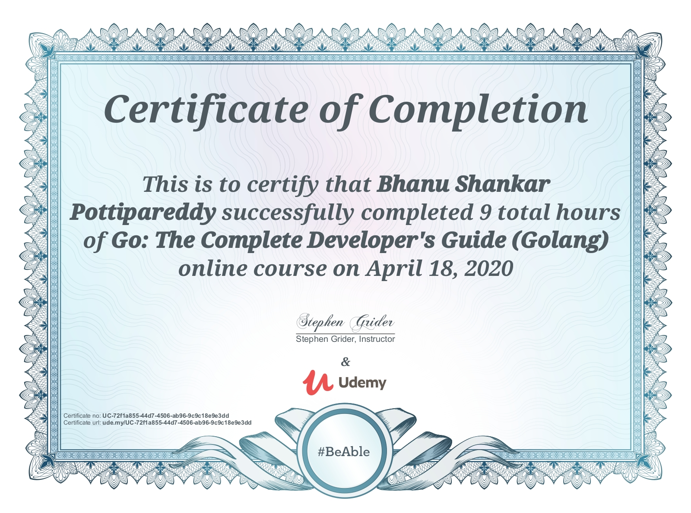
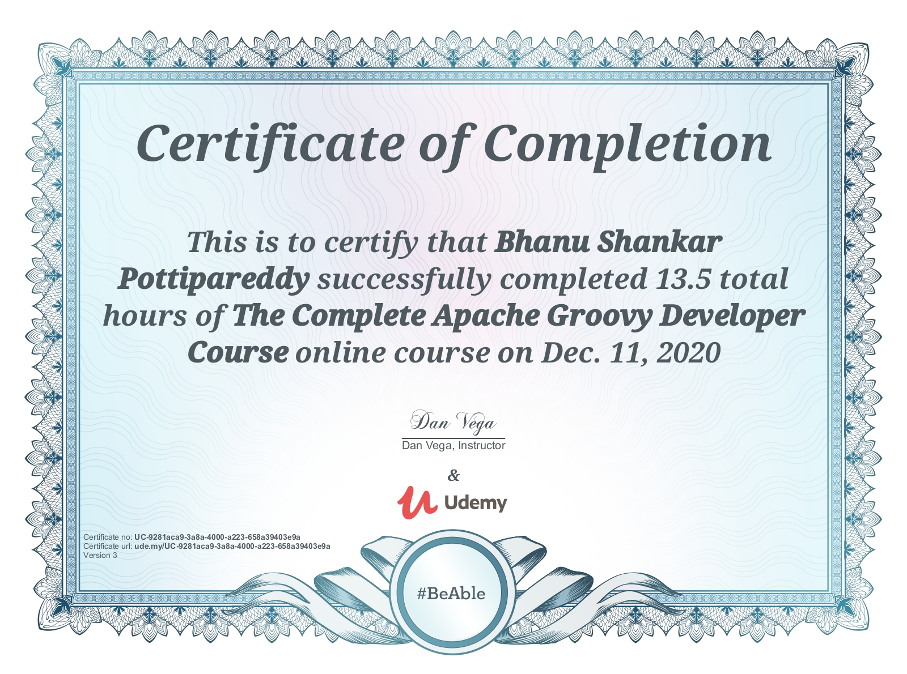
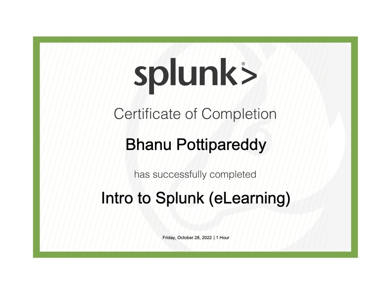
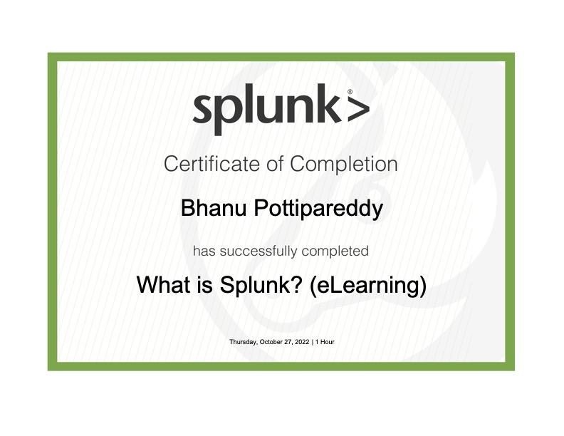
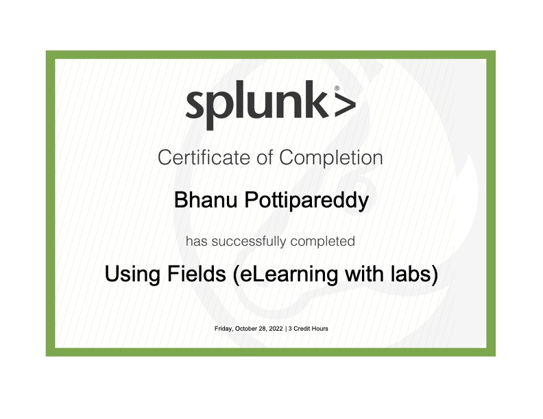
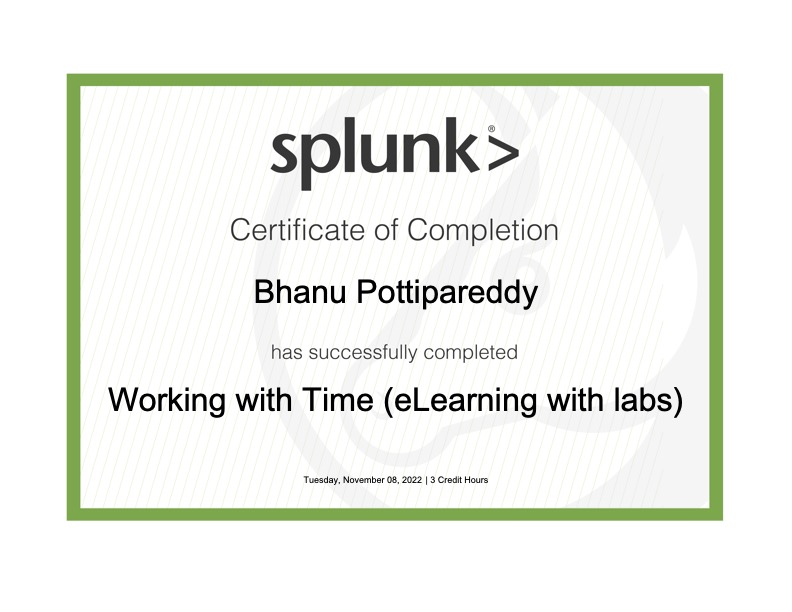
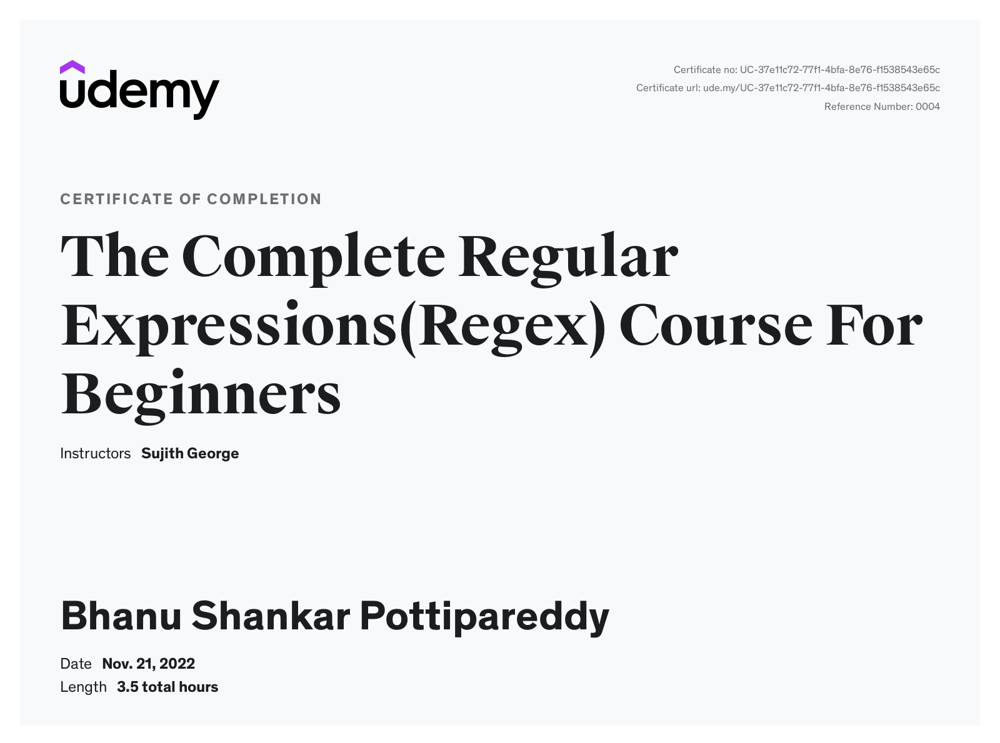

# learnings
## Golang

  
Udemy Golang - Complete Developer's Guide

  
  

## Groovy

  
Udemy Groovy - Apache Groovy Developer

  
  

## Splunk

  
Intro to Splunk

  
  

  
What is Splunk

  
  

  
Using Fields

  
  

  
Visualizations

  
  

  
Working with time

  
  

## Regex

  
Udemy Regular Expressions

  
  

