# learnings
## Golang

  
Udemy Golang - Complete Developer's Guide

  
  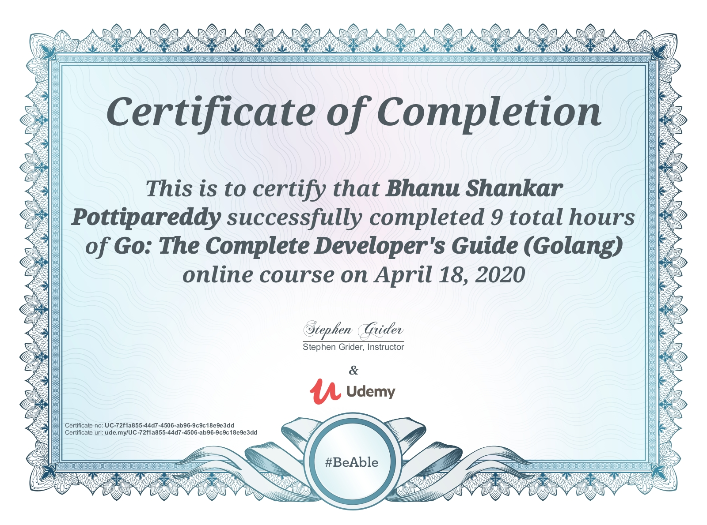

## Groovy

  
Udemy Groovy - Apache Groovy Developer

  
  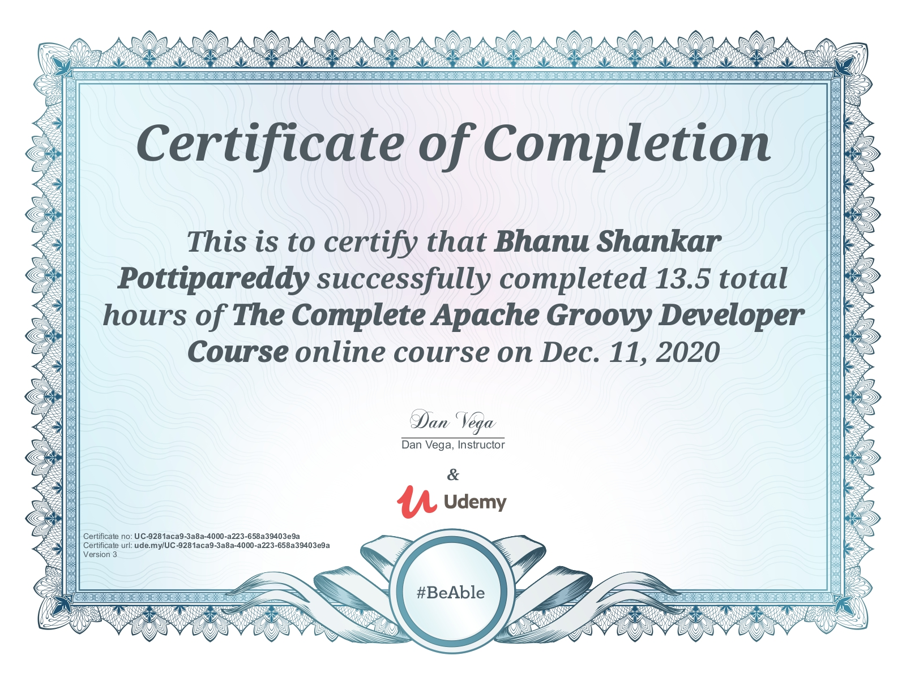

## Splunk Certifications

  
Splunk Core Certified Power User

  
  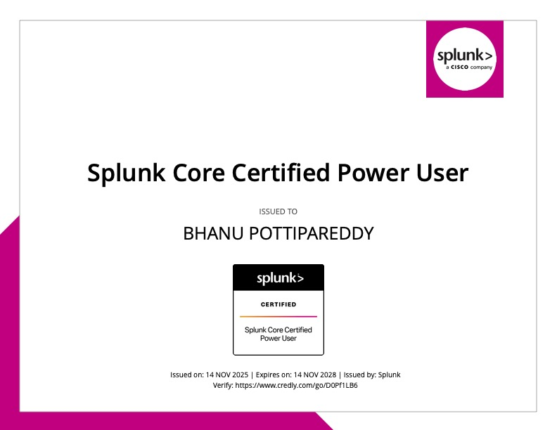

## Splunk o11y Cloud

  
Introduction to Splunk Infrastructure Monitoring

  
  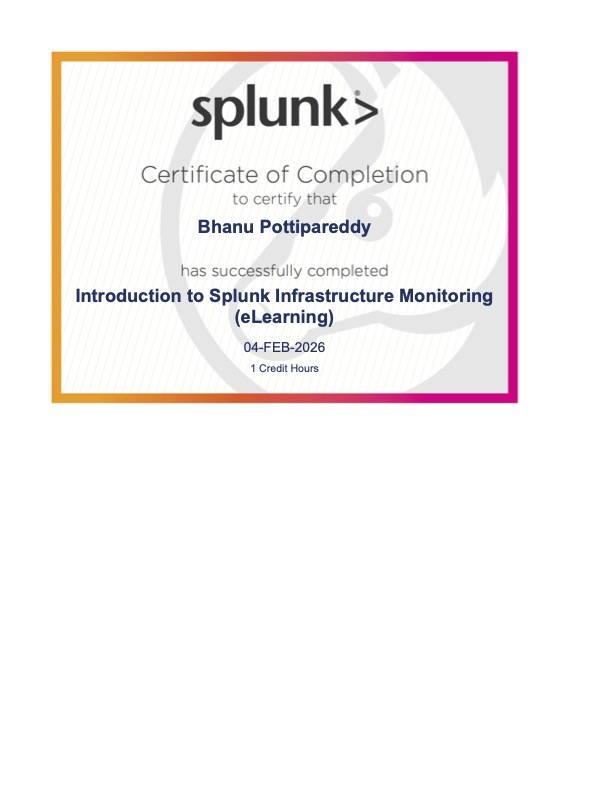

  
Getting Data into Splunk Observability Cloud

  
  

  
Splunk Observability Cloud Teams

  
  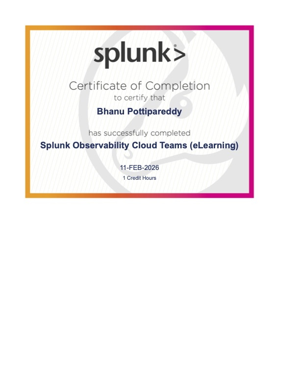

  
Splunk Observability Cloud: Enterprise Features

  
  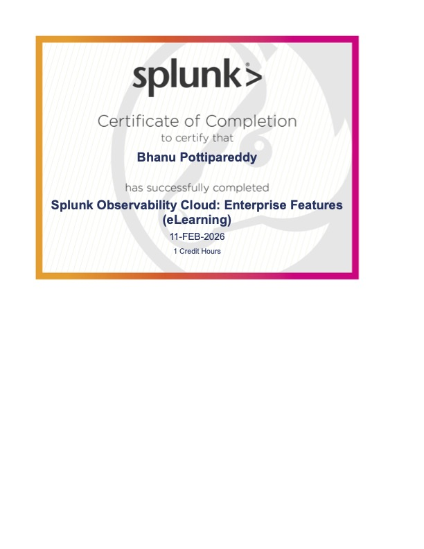

## Splunk

  
Intro to Splunk

  
  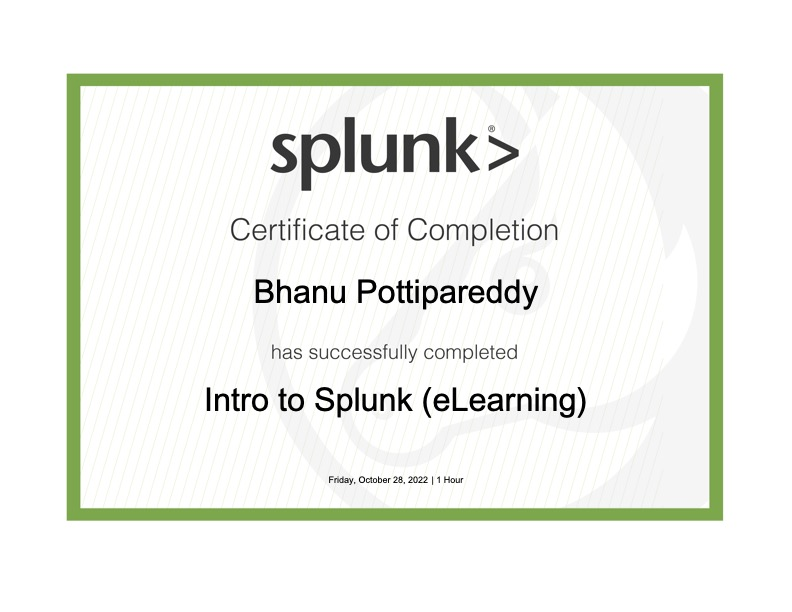

  
What is Splunk

  
  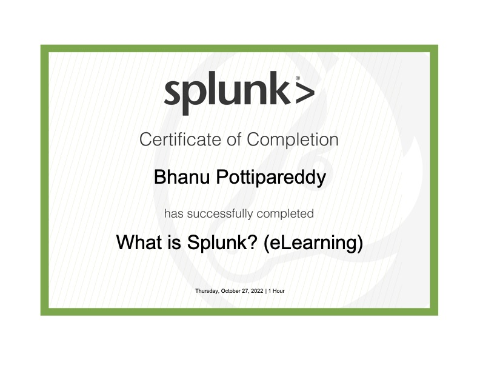

  
Using Fields

  
  

  
Visualizations

  
  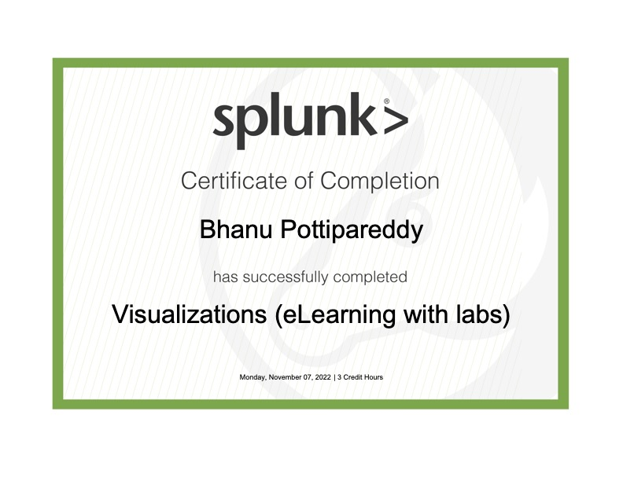

  
Working with time

  
  

  
Statistical Processing

  
  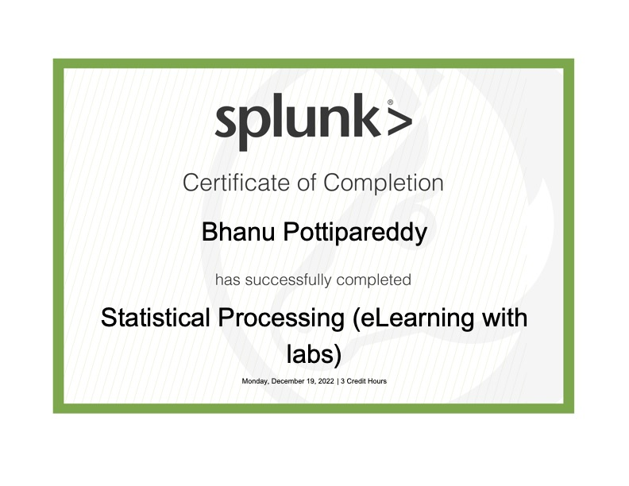

  
Comparing Values

  
  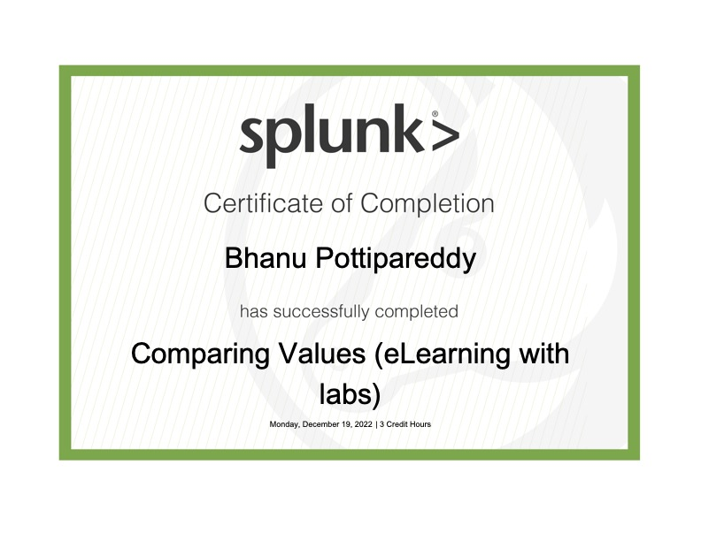

  
Result Modification

  
  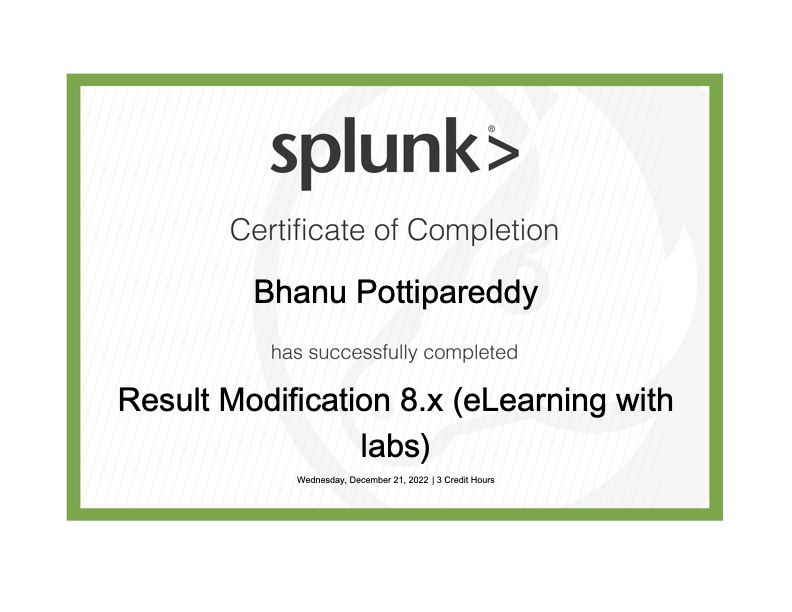

  
Correlation Analysis

  
  

  
Intro to Knowledge Objects

  
  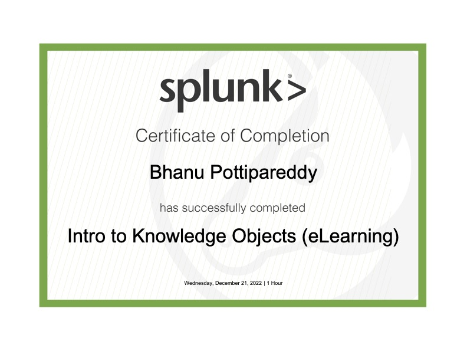

  
Create Knowledge Objects

  
  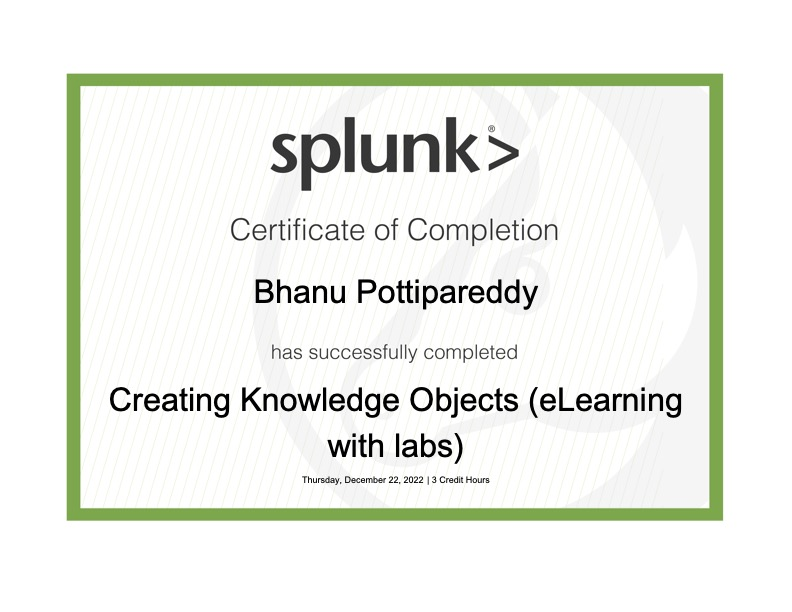

  
Field Extractions

  
  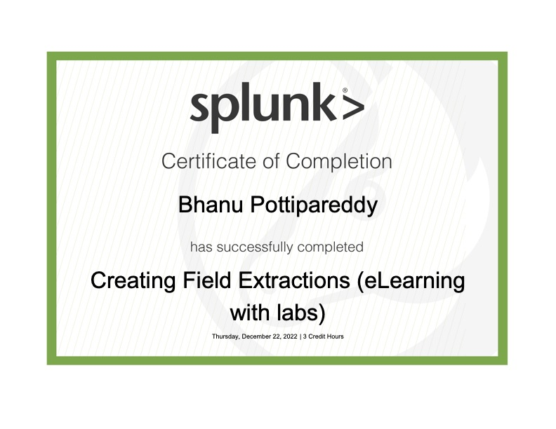

  
Data Models

  
  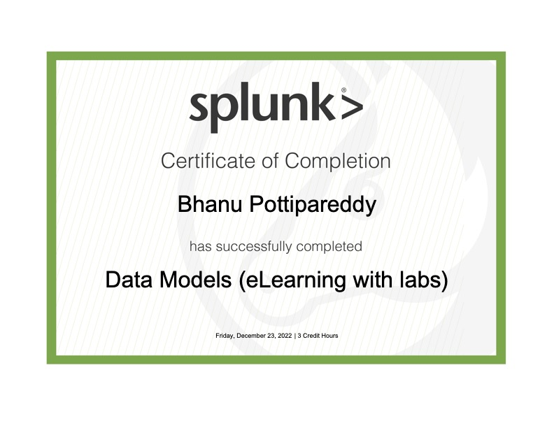

## OWASP

  
OWASP Top 10

  
  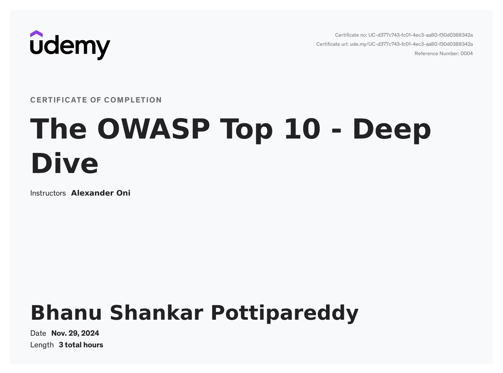

## Regex

  
Udemy Regular Expressions

  
  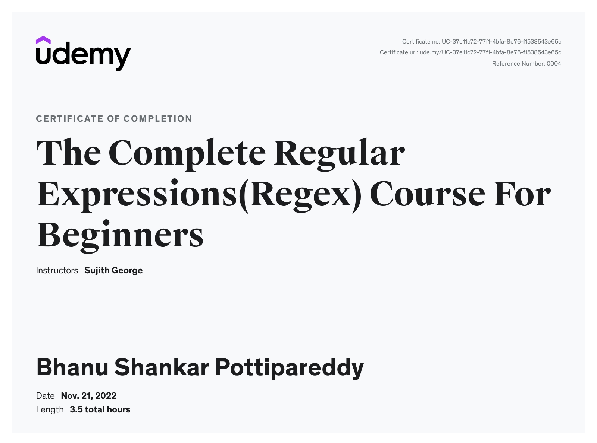

